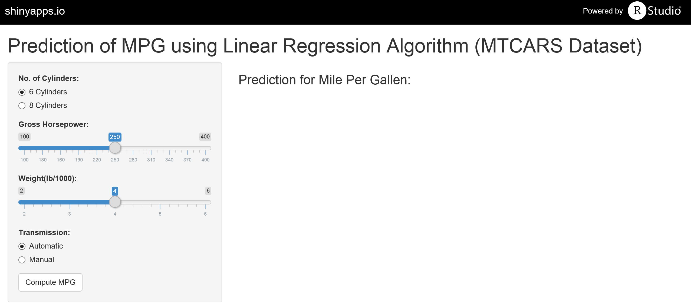
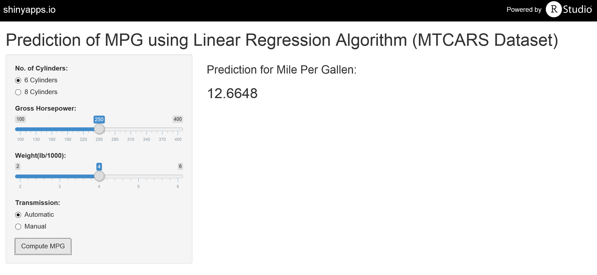

Prediction of Fuel Efficiency using Linear Regression Algorithm
========================================================

Introduction
========================================================

This application uses linear regression algorithm to predict the fuel efficiency of motor vehicle (mpg) with four independent variables namely, no. of cylinder (cyl), gross horsepower (hp), weight (wt), and type of transmission (am).

<font color="blue">
- Dataset: mtcars
- Regression Formula: mpg ~ cyl + hp + wt + am
- Adjusted R-squared Value: 0.84
</font>

Linear Regression Model
========================================================


<font size=5>

```

Call:
lm(formula = mpg ~ cyl + hp + wt + am, data = mtcars)

Residuals:
    Min      1Q  Median      3Q     Max 
-3.9387 -1.2560 -0.4013  1.1253  5.0513 

Coefficients:
            Estimate Std. Error t value Pr(>|t|)    
(Intercept) 33.70832    2.60489  12.940 7.73e-13 ***
cyl6        -3.03134    1.40728  -2.154  0.04068 *  
cyl8        -2.16368    2.28425  -0.947  0.35225    
hp          -0.03211    0.01369  -2.345  0.02693 *  
wt          -2.49683    0.88559  -2.819  0.00908 ** 
amManual     1.80921    1.39630   1.296  0.20646    
---
Signif. codes:  0 '***' 0.001 '**' 0.01 '*' 0.05 '.' 0.1 ' ' 1

Residual standard error: 2.41 on 26 degrees of freedom
Multiple R-squared:  0.8659,	Adjusted R-squared:  0.8401 
F-statistic: 33.57 on 5 and 26 DF,  p-value: 1.506e-10
```
</font>

The Shiny Application: Input
========================================================


Select input for No. of Cylinders, Gross Horsepower, Weight and Transmission. Once ready, click on the "Compute MPG" button. The result will be displayed on the right of the screen.

The Shiny Application: Output
========================================================


Example: The fuel efficiency of an automatic motor vehicle with 6 cylinders, gross horsepower of 250, and weighing 4000 lb is <font color="red">12.6648</font> mpg.

